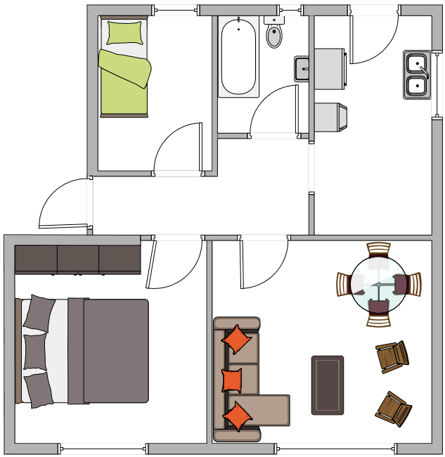

# Abstract

This is an example of an annotated Building Model. The 
idea is that this kind of input file contains the rationale 
behind the modelling process, and not just the necessary 
input data. It also allows reporting.

This example focuses on simulating a simple apartment.

# Introduction

This file is an example of how to model a simple apartment. This section provides details about the 
apartment itself, before any modeling happens.

## Apartment layout

The apartment we will model has a total of five 
spaces:
- The main bedroom
- The second bedroom
- The Bathroom
- The Kitchen
- The living room

The main bedroom and the living room face East, the Kitchen faces North, 
and the other three spaces face West.




## Materials

All the windows are single glazing, and the walls are 
13cm concrete. They are painted white on the interior, and exposed outside.

# Modelling the apartment

After knowing what is it that we need to model, let's now model the apartment.

## Materiality

While not strictly mandatory, I usually take a 
bottom-up approach to modelling. This implies starting from the most basic elements, and then
build up in complexity. So, I will start with the 
materials.

### Finishings

A 'Finishing' represents the optical properties of both ends of a construction or surface. For 
instance, it is appropriate for modelling things like paintings or any other really thin element
in the facade that does not contribute to thermal, acoustic or other phenomena.

```rust
// This downloads the materials from the database
// (or use local ones, if available) and loads them into the model
use simple_defaults::default_reflectances::wall as "wall exterior";

// We also mentioned that this was painted on the inside
use spectral_db::white_paint as "white paint";
```

### Substances

Substances represent the interior of the walls. For instance, if we wanted to represent Concrete, we can
do the following:

```rust 
Substance {
    // this is how we write text
    name: "concrete", 

    // this is how we write numbers
    thermal_conductivity: 1.63, // in W/m.K

    specific_heat_capacity: 800, // in J/kg.K

    density: 2400 // in kg/m3
}

Substance {
    // this is how we write text
    name: "glass", 

    // this is how we write numbers
    thermal_conductivity: 1.63, // in W/m.K

    specific_heat_capacity: 800, // in J/kg.K

    density: 2400 // in kg/m3
}
```

The idea of having a Substance component (as opposed to EnergyPlus, 
for instance, which jumps directly to Materials) is that the same Substance
can be used for surfaces of different thicknesses. For example, a 10cm
concrete wall will use the same substance as a 15cm concrete wall.

### Materials

Materials are Substances with thickness. Nothing else, really. So, 
let's add the 13cm concrete for the walls and ceilings and floor.

```rust
Material{
    name: "13cm concrete",
    // this is the name of the Substance we have already added
    substance: "concrete", 
    thickness: 0.13 // 13cm in meters is 0.13    

}
// the same idea with the glass
Material{
    name: "3mm glass",
    substance: "glass", 
    thickness: 0.003 
}
```

### Constructions

Constructions are combinations of Materials; that is, they are a sandwich of one or more Materials.

```rust
Construction {
    name: "Concrete Surface",
    layers:[
        "13cm concrete"
    ]
}

Construction {
    name: "Window material",
    layers: [
        "3mm glass"
    ]
}
```


## Spaces

```rust control

let space_i = 0;

// Get space temperature
let space_t = space_temperature(space_i);

// Get the total air exchange of the space
let space_total_air_flow = space_total_air_flow(space_i); // m3/s
let space_achs = space_total_air_flow/space_volume(space_i); // achs

if space_t > 25 {    
    // if too hot 
    if space_achs > 6 {
        // too much wind... try closing the windows and cooling down.
        close_space_windows(space_i);
        turn_space_heating_off(space_i)
        turn_space_cooling_on(space_i)
    }else{
        // Windows seem to be closed...yry opening windows
        let did_open = open_space_windows(space_i);
        if !did_open {
            // if there were no windows, 
            turn_space_heating_off(space_i)
            turn_space_cooling_on(space_i)
        }
    }
}if space_t < 18 {
    turn_space_cooling_off(space_i)    
    turn_space_heater_on(space_i)
}else{
    // Do nothing... just turn everything off
    turn_space_heating_off(space_i)
    turn_space_cooling_off(space_i)    
}


```

```rust


// Create a building
Building {
    name: "the building", 
}

// Crate a space in the Building
Space {
    building: "the building",

    // You can comment your inputs
    volume: 12, 
}
```

## Surfaces

Asd

```rust
Surface{

}

Fenestration{
    
}
```

# asd


